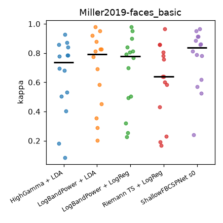
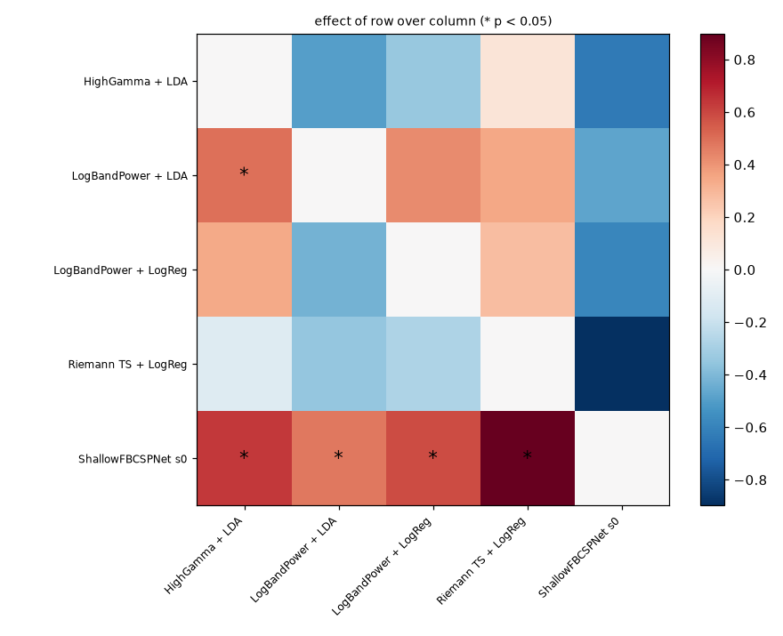
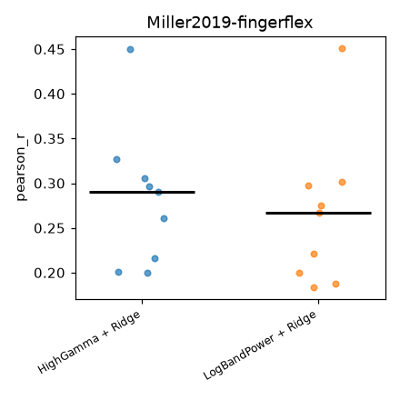
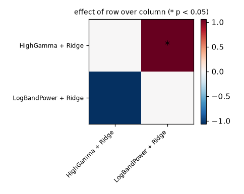
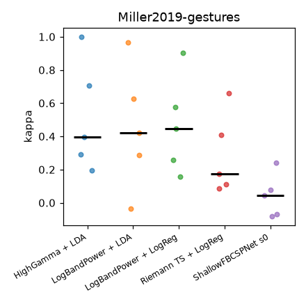
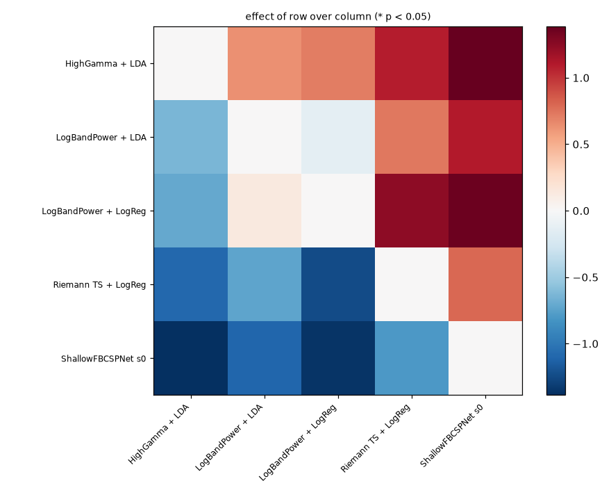
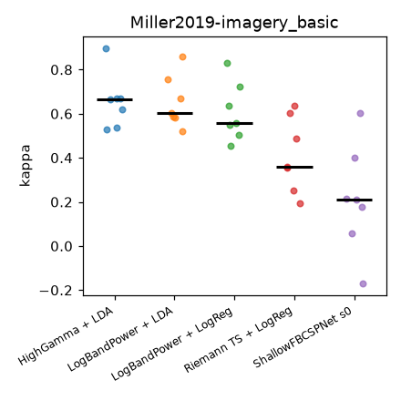
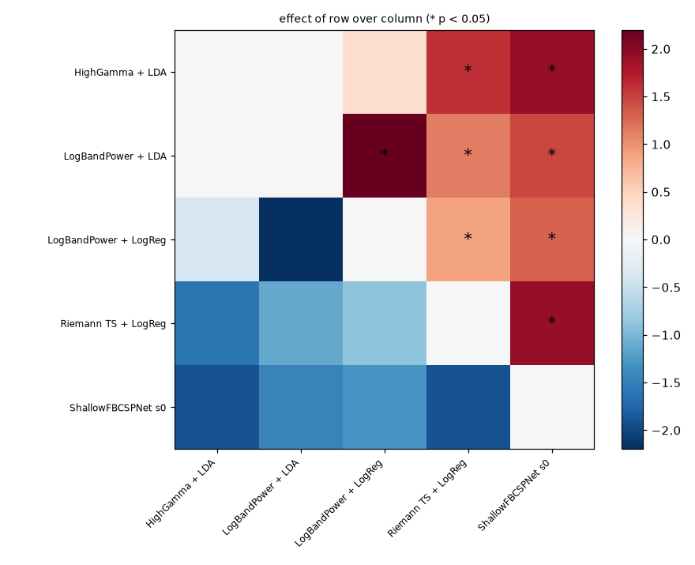
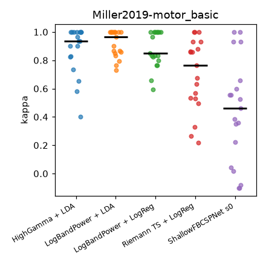
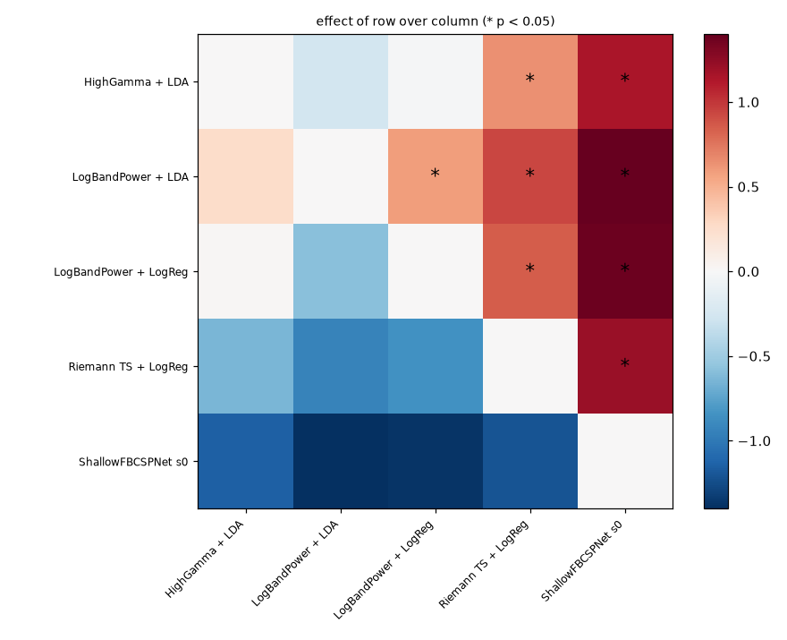

# Reference benchmark analysis

Generated 2026-09-11 by `scripts/build_analysis.py` from `results/reference_*.csv`. Scores are per patient (mean over folds); tests are paired across patients (sign-flip permutation below 20 patients, Wilcoxon signed-rank otherwise, one-sided, combined with Stouffer weights); effect sizes are Cohen's d_z of the paired differences. See `docs/moabb_review.md`, section 7.

## bci_iii_1 (cross_session, kappa, 1 patients)

| pipeline | mean | sd | median | patients |
|---|---|---|---|---|
| Riemann TS + LogReg | 0.548 | nan | 0.548 | 1 |
| LogBandPower + LDA | 0.356 | nan | 0.356 | 1 |
| LogBandPower + LogReg | 0.243 | nan | 0.243 | 1 |
| HighGamma + LDA | 0.000 | nan | 0.000 | 1 |

## bci_iii_1 (within_subject, kappa, 1 patients)

| pipeline | mean | sd | median | patients |
|---|---|---|---|---|
| Riemann TS + LogReg | 0.823 | nan | 0.823 | 1 |
| LogBandPower + LDA | 0.801 | nan | 0.801 | 1 |
| LogBandPower + LogReg | 0.791 | nan | 0.791 | 1 |
| HighGamma + LDA | 0.659 | nan | 0.659 | 1 |

## faces_basic (within_subject, kappa, 14 patients)

| pipeline | mean | sd | median | patients |
|---|---|---|---|---|
| ShallowFBCSPNet s0 | 0.763 | 0.205 | 0.836 | 14 |
| LogBandPower + LDA | 0.682 | 0.260 | 0.792 | 14 |
| LogBandPower + LogReg | 0.667 | 0.259 | 0.780 | 14 |
| HighGamma + LDA | 0.638 | 0.262 | 0.736 | 14 |
| Riemann TS + LogReg | 0.608 | 0.262 | 0.639 | 14 |

Mean rank (1 = best), Friedman p = 0.0031: ShallowFBCSPNet s0 1.71, LogBandPower + LDA 2.64, LogBandPower + LogReg 3.29, HighGamma + LDA 3.50, Riemann TS + LogReg 3.86

Significant pairwise differences (row beats column, p < 0.05):

- ShallowFBCSPNet s0 > Riemann TS + LogReg: p = 0.0005, d_z = 0.90
- ShallowFBCSPNet s0 > LogBandPower + LogReg: p = 0.0091, d_z = 0.59
- ShallowFBCSPNet s0 > HighGamma + LDA: p = 0.0097, d_z = 0.63
- ShallowFBCSPNet s0 > LogBandPower + LDA: p = 0.0341, d_z = 0.47
- LogBandPower + LDA > HighGamma + LDA: p = 0.0436, d_z = 0.50

## fingerflex (within_subject, pearson_r, 9 patients)

| pipeline | mean | sd | median | patients |
|---|---|---|---|---|
| HighGamma + Ridge | 0.283 | 0.078 | 0.290 | 9 |
| LogBandPower + Ridge | 0.265 | 0.083 | 0.267 | 9 |

Mean rank (1 = best): HighGamma + Ridge 1.22, LogBandPower + Ridge 1.78

Significant pairwise differences (row beats column, p < 0.05):

- HighGamma + Ridge > LogBandPower + Ridge: p = 0.0156, d_z = 1.06

## gestures (within_subject, kappa, 5 patients)

| pipeline | mean | sd | median | patients |
|---|---|---|---|---|
| HighGamma + LDA | 0.518 | 0.332 | 0.395 | 5 |
| LogBandPower + LogReg | 0.468 | 0.292 | 0.446 | 5 |
| LogBandPower + LDA | 0.454 | 0.374 | 0.423 | 5 |
| Riemann TS + LogReg | 0.287 | 0.243 | 0.175 | 5 |
| ShallowFBCSPNet s0 | 0.043 | 0.130 | 0.044 | 5 |

Mean rank (1 = best), Friedman p = 0.0107: HighGamma + LDA 1.60, LogBandPower + LDA 2.40, LogBandPower + LogReg 2.40, Riemann TS + LogReg 3.80, ShallowFBCSPNet s0 4.80

No pairwise difference reaches p < 0.05.

## imagery_basic (within_subject, kappa, 7 patients)

| pipeline | mean | sd | median | patients |
|---|---|---|---|---|
| HighGamma + LDA | 0.655 | 0.123 | 0.666 | 7 |
| LogBandPower + LDA | 0.654 | 0.118 | 0.603 | 7 |
| LogBandPower + LogReg | 0.609 | 0.132 | 0.556 | 7 |
| Riemann TS + LogReg | 0.412 | 0.169 | 0.361 | 7 |
| ShallowFBCSPNet s0 | 0.214 | 0.245 | 0.211 | 7 |

Mean rank (1 = best), Friedman p = 0.000195: HighGamma + LDA 1.57, LogBandPower + LDA 1.86, LogBandPower + LogReg 2.86, Riemann TS + LogReg 3.71, ShallowFBCSPNet s0 5.00

Significant pairwise differences (row beats column, p < 0.05):

- HighGamma + LDA > Riemann TS + LogReg: p = 0.0155, d_z = 1.61
- HighGamma + LDA > ShallowFBCSPNet s0: p = 0.0155, d_z = 1.92
- LogBandPower + LDA > LogBandPower + LogReg: p = 0.0155, d_z = 2.20
- LogBandPower + LDA > ShallowFBCSPNet s0: p = 0.0155, d_z = 1.48
- LogBandPower + LogReg > ShallowFBCSPNet s0: p = 0.0155, d_z = 1.30
- Riemann TS + LogReg > ShallowFBCSPNet s0: p = 0.0155, d_z = 1.92
- LogBandPower + LDA > Riemann TS + LogReg: p = 0.031, d_z = 1.12
- LogBandPower + LogReg > Riemann TS + LogReg: p = 0.031, d_z = 0.89

## motor_basic (within_subject, kappa, 19 patients)

| pipeline | mean | sd | median | patients |
|---|---|---|---|---|
| LogBandPower + LDA | 0.917 | 0.094 | 0.967 | 19 |
| LogBandPower + LogReg | 0.880 | 0.129 | 0.852 | 19 |
| HighGamma + LDA | 0.877 | 0.171 | 0.933 | 19 |
| Riemann TS + LogReg | 0.702 | 0.255 | 0.767 | 19 |
| ShallowFBCSPNet s0 | 0.438 | 0.371 | 0.463 | 19 |

Mean rank (1 = best), Friedman p = 2.38e-08: LogBandPower + LDA 2.13, HighGamma + LDA 2.21, LogBandPower + LogReg 2.53, Riemann TS + LogReg 3.50, ShallowFBCSPNet s0 4.63

Significant pairwise differences (row beats column, p < 0.05):

- LogBandPower + LDA > ShallowFBCSPNet s0: p = 0.0002, d_z = 1.40
- LogBandPower + LogReg > ShallowFBCSPNet s0: p = 0.0002, d_z = 1.37
- Riemann TS + LogReg > ShallowFBCSPNet s0: p = 0.0002, d_z = 1.21
- HighGamma + LDA > ShallowFBCSPNet s0: p = 0.0003, d_z = 1.14
- LogBandPower + LDA > Riemann TS + LogReg: p = 0.0003, d_z = 0.94
- LogBandPower + LogReg > Riemann TS + LogReg: p = 0.0013, d_z = 0.85
- HighGamma + LDA > Riemann TS + LogReg: p = 0.0065, d_z = 0.64
- LogBandPower + LDA > LogBandPower + LogReg: p = 0.0074, d_z = 0.59

