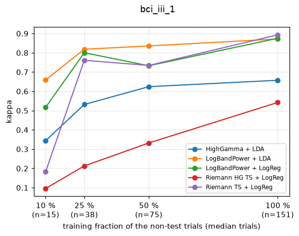
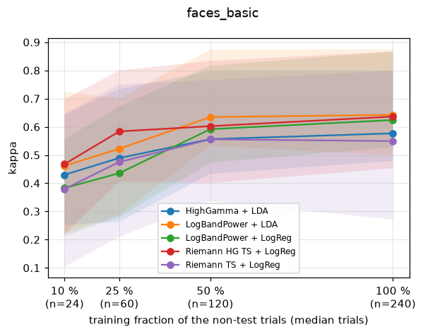
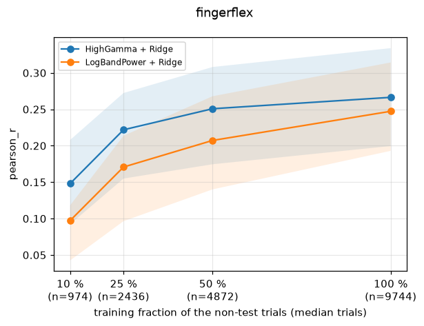
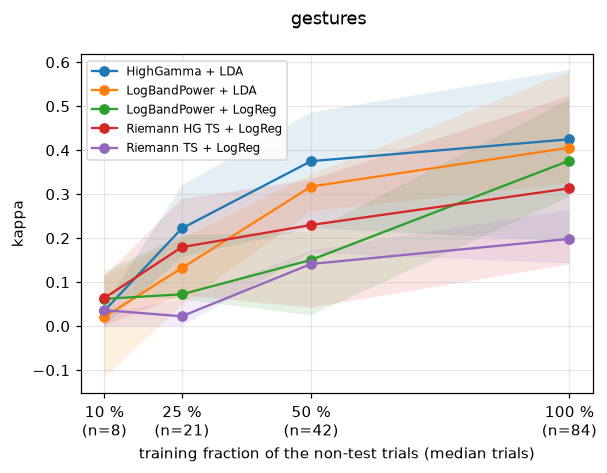
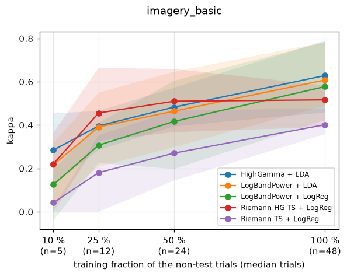
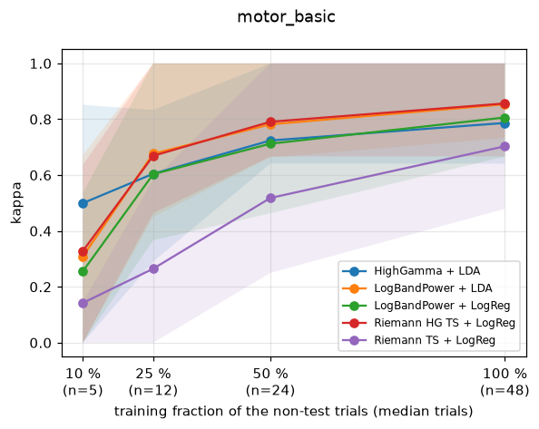

# Reference benchmark analysis

Generated 2026-09-11 by `scripts/build_analysis.py` from `results/reference_*.csv`. Scores are per patient (mean over folds); tests are paired across patients (sign-flip permutation below 20 patients, Wilcoxon signed-rank otherwise, one-sided, combined with Stouffer weights); effect sizes are Cohen's d_z of the paired differences. See `docs/moabb_review.md`, section 7.

## bci_iii_1 (cross_session, kappa, 1 patients)

| pipeline | mean | sd | median | patients |
|---|---|---|---|---|
| LogBandPower + BatchZ + LDA | 0.750 | nan | 0.750 | 1 |
| Riemann TS + LogReg | 0.548 | nan | 0.548 | 1 |
| LogBandPower + LDA | 0.356 | nan | 0.356 | 1 |
| LogBandPower + LogReg | 0.243 | nan | 0.243 | 1 |
| Riemann HG TS + LogReg | 0.180 | nan | 0.180 | 1 |
| HighGamma + LDA | 0.000 | nan | 0.000 | 1 |

## bci_iii_1 (cross_session:ea, kappa, 1 patients)

| pipeline | mean | sd | median | patients |
|---|---|---|---|---|
| LogBandPower + BatchZ + LDA | 0.743 | nan | 0.743 | 1 |
| Riemann TS + LogReg | 0.477 | nan | 0.477 | 1 |
| LogBandPower + LogReg | 0.050 | nan | 0.050 | 1 |
| HighGamma + LDA | 0.010 | nan | 0.010 | 1 |
| LogBandPower + LDA | 0.010 | nan | 0.010 | 1 |
| Riemann HG TS + LogReg | -0.004 | nan | -0.004 | 1 |

## bci_iii_1 (cross_session:recenter, kappa, 1 patients)

| pipeline | mean | sd | median | patients |
|---|---|---|---|---|
| Riemann TS + LogReg | 0.790 | nan | 0.790 | 1 |
| LogBandPower + BatchZ + LDA | 0.753 | nan | 0.753 | 1 |
| LogBandPower + LogReg | 0.260 | nan | 0.260 | 1 |
| LogBandPower + LDA | 0.160 | nan | 0.160 | 1 |
| Riemann HG TS + LogReg | 0.047 | nan | 0.047 | 1 |
| HighGamma + LDA | 0.010 | nan | 0.010 | 1 |

## bci_iii_1 (cross_session:zscore, kappa, 1 patients)

| pipeline | mean | sd | median | patients |
|---|---|---|---|---|
| LogBandPower + BatchZ + LDA | 0.750 | nan | 0.750 | 1 |
| LogBandPower + LogReg | 0.345 | nan | 0.345 | 1 |
| LogBandPower + LDA | 0.144 | nan | 0.144 | 1 |
| Riemann HG TS + LogReg | 0.129 | nan | 0.129 | 1 |
| Riemann TS + LogReg | 0.011 | nan | 0.011 | 1 |
| HighGamma + LDA | 0.004 | nan | 0.004 | 1 |

## bci_iii_1 (learning_curve, kappa, 1 patients)

Train on the first 10/25/50/100 % of the non-test trials of every (patient, session), test on the fixed final 20 %. The last column is the smallest fraction whose mean reaches 90 % of the full-data mean.

| pipeline | 10 % (n=15) | 25 % (n=38) | 50 % (n=75) | 100 % (n=151) | 90 % of full at |
|---|---|---|---|---|---|
| Riemann TS + LogReg | 0.182 | 0.761 | 0.734 | 0.893 | 100 % |
| LogBandPower + LogReg | 0.516 | 0.801 | 0.733 | 0.875 | 25 % |
| LogBandPower + LDA | 0.659 | 0.818 | 0.836 | 0.872 | 25 % |
| HighGamma + LDA | 0.344 | 0.532 | 0.624 | 0.657 | 50 % |
| Riemann HG TS + LogReg | 0.095 | 0.213 | 0.332 | 0.542 | 100 % |

## bci_iii_1 (within_subject, kappa, 1 patients)

| pipeline | mean | sd | median | patients |
|---|---|---|---|---|
| Riemann TS + LogReg | 0.823 | nan | 0.823 | 1 |
| LogBandPower + LDA | 0.801 | nan | 0.801 | 1 |
| LogBandPower + LogReg | 0.791 | nan | 0.791 | 1 |
| LogBandPower + BatchZ + LDA | 0.763 | nan | 0.763 | 1 |
| HighGamma + LDA | 0.659 | nan | 0.659 | 1 |
| Riemann HG TS + LogReg | 0.618 | nan | 0.618 | 1 |

## bci_iii_1 (within_subject:ea, kappa, 1 patients)

| pipeline | mean | sd | median | patients |
|---|---|---|---|---|
| Riemann TS + LogReg | 0.848 | nan | 0.848 | 1 |
| LogBandPower + LogReg | 0.838 | nan | 0.838 | 1 |
| LogBandPower + LDA | 0.824 | nan | 0.824 | 1 |
| LogBandPower + BatchZ + LDA | 0.773 | nan | 0.773 | 1 |
| HighGamma + LDA | 0.753 | nan | 0.753 | 1 |
| Riemann HG TS + LogReg | 0.618 | nan | 0.618 | 1 |

## faces_basic (learning_curve, kappa, 14 patients)

Train on the first 10/25/50/100 % of the non-test trials of every (patient, session), test on the fixed final 20 %. The last column is the smallest fraction whose mean reaches 90 % of the full-data mean.

| pipeline | 10 % (n=24) | 25 % (n=60) | 50 % (n=120) | 100 % (n=240) | 90 % of full at |
|---|---|---|---|---|---|
| LogBandPower + LDA | 0.462 | 0.522 | 0.635 | 0.642 | 50 % |
| Riemann HG TS + LogReg | 0.468 | 0.584 | 0.602 | 0.636 | 25 % |
| LogBandPower + LogReg | 0.383 | 0.436 | 0.592 | 0.624 | 50 % |
| HighGamma + LDA | 0.430 | 0.489 | 0.556 | 0.577 | 50 % |
| Riemann TS + LogReg | 0.379 | 0.475 | 0.556 | 0.549 | 50 % |

## faces_basic (within_subject, kappa, 14 patients)

| pipeline | mean | sd | median | patients |
|---|---|---|---|---|
| ShallowFBCSPNet s0 | 0.763 | 0.205 | 0.836 | 14 |
| ShallowFBCSPNet s1 | 0.749 | 0.211 | 0.841 | 14 |
| Riemann HG TS + LogReg | 0.738 | 0.229 | 0.849 | 14 |
| LogBandPower + LDA | 0.682 | 0.260 | 0.792 | 14 |
| LogBandPower + LogReg | 0.667 | 0.259 | 0.780 | 14 |
| HighGamma + LDA | 0.638 | 0.262 | 0.736 | 14 |
| Riemann TS + LogReg | 0.608 | 0.262 | 0.639 | 14 |

Mean rank (1 = best), Friedman p = 0.000502: ShallowFBCSPNet s0 2.50, ShallowFBCSPNet s1 2.93, Riemann HG TS + LogReg 3.21, LogBandPower + LDA 4.00, LogBandPower + LogReg 4.79, HighGamma + LDA 5.07, Riemann TS + LogReg 5.50

Significant pairwise differences (row beats column, p < 0.05):

- ShallowFBCSPNet s0 > Riemann TS + LogReg: p = 0.0005, d_z = 0.90
- ShallowFBCSPNet s1 > Riemann TS + LogReg: p = 0.0005, d_z = 0.90
- Riemann HG TS + LogReg > HighGamma + LDA: p = 0.0008, d_z = 0.97
- ShallowFBCSPNet s0 > LogBandPower + LogReg: p = 0.0091, d_z = 0.59
- ShallowFBCSPNet s0 > HighGamma + LDA: p = 0.0097, d_z = 0.63
- Riemann HG TS + LogReg > LogBandPower + LogReg: p = 0.0105, d_z = 0.71
- Riemann HG TS + LogReg > Riemann TS + LogReg: p = 0.0137, d_z = 0.65
- ShallowFBCSPNet s1 > HighGamma + LDA: p = 0.02, d_z = 0.55
- Riemann HG TS + LogReg > LogBandPower + LDA: p = 0.0256, d_z = 0.55
- ShallowFBCSPNet s1 > LogBandPower + LogReg: p = 0.0313, d_z = 0.47
- ShallowFBCSPNet s0 > LogBandPower + LDA: p = 0.0341, d_z = 0.47
- LogBandPower + LDA > HighGamma + LDA: p = 0.0436, d_z = 0.50

## fingerflex (learning_curve, pearson_r, 9 patients)

Train on the first 10/25/50/100 % of the non-test trials of every (patient, session), test on the fixed final 20 %. The last column is the smallest fraction whose mean reaches 90 % of the full-data mean.

| pipeline | 10 % (n=974) | 25 % (n=2436) | 50 % (n=4872) | 100 % (n=9744) | 90 % of full at |
|---|---|---|---|---|---|
| HighGamma + Ridge | 0.148 | 0.222 | 0.251 | 0.266 | 50 % |
| LogBandPower + Ridge | 0.097 | 0.171 | 0.207 | 0.247 | 100 % |

## fingerflex (within_subject, pearson_r, 9 patients)

| pipeline | mean | sd | median | patients |
|---|---|---|---|---|
| HighGamma + Ridge | 0.283 | 0.078 | 0.290 | 9 |
| LogBandPower + Ridge | 0.265 | 0.083 | 0.267 | 9 |

Mean rank (1 = best): HighGamma + Ridge 1.22, LogBandPower + Ridge 1.78

Significant pairwise differences (row beats column, p < 0.05):

- HighGamma + Ridge > LogBandPower + Ridge: p = 0.0156, d_z = 1.06

## gestures (learning_curve, kappa, 5 patients)

Train on the first 10/25/50/100 % of the non-test trials of every (patient, session), test on the fixed final 20 %. The last column is the smallest fraction whose mean reaches 90 % of the full-data mean.

| pipeline | 10 % (n=8) | 25 % (n=21) | 50 % (n=42) | 100 % (n=84) | 90 % of full at |
|---|---|---|---|---|---|
| HighGamma + LDA | 0.035 | 0.222 | 0.375 | 0.425 | 100 % |
| LogBandPower + LDA | 0.021 | 0.132 | 0.317 | 0.406 | 100 % |
| LogBandPower + LogReg | 0.062 | 0.072 | 0.150 | 0.376 | 100 % |
| Riemann HG TS + LogReg | 0.064 | 0.180 | 0.230 | 0.313 | 100 % |
| Riemann TS + LogReg | 0.036 | 0.022 | 0.141 | 0.198 | 100 % |

## gestures (within_subject, kappa, 5 patients)

| pipeline | mean | sd | median | patients |
|---|---|---|---|---|
| HighGamma + LDA | 0.518 | 0.332 | 0.395 | 5 |
| LogBandPower + LogReg | 0.468 | 0.292 | 0.446 | 5 |
| LogBandPower + LDA | 0.454 | 0.374 | 0.423 | 5 |
| Riemann HG TS + LogReg | 0.392 | 0.393 | 0.312 | 5 |
| Riemann TS + LogReg | 0.287 | 0.243 | 0.175 | 5 |
| ShallowFBCSPNet s0 | 0.043 | 0.130 | 0.044 | 5 |

Mean rank (1 = best), Friedman p = 0.00899: HighGamma + LDA 1.70, LogBandPower + LogReg 2.60, LogBandPower + LDA 2.80, Riemann HG TS + LogReg 3.70, Riemann TS + LogReg 4.40, ShallowFBCSPNet s0 5.80

No pairwise difference reaches p < 0.05.

## imagery_basic (learning_curve, kappa, 7 patients)

Train on the first 10/25/50/100 % of the non-test trials of every (patient, session), test on the fixed final 20 %. The last column is the smallest fraction whose mean reaches 90 % of the full-data mean.

| pipeline | 10 % (n=5) | 25 % (n=12) | 50 % (n=24) | 100 % (n=48) | 90 % of full at |
|---|---|---|---|---|---|
| HighGamma + LDA | 0.285 | 0.396 | 0.483 | 0.629 | 100 % |
| LogBandPower + LDA | 0.217 | 0.391 | 0.464 | 0.608 | 100 % |
| LogBandPower + LogReg | 0.125 | 0.307 | 0.417 | 0.578 | 100 % |
| Riemann HG TS + LogReg | 0.221 | 0.456 | 0.510 | 0.517 | 50 % |
| Riemann TS + LogReg | 0.042 | 0.181 | 0.271 | 0.402 | 100 % |

## imagery_basic (within_subject, kappa, 7 patients)

| pipeline | mean | sd | median | patients |
|---|---|---|---|---|
| HighGamma + LDA | 0.655 | 0.123 | 0.666 | 7 |
| LogBandPower + LDA | 0.654 | 0.118 | 0.603 | 7 |
| Riemann HG TS + LogReg | 0.619 | 0.161 | 0.578 | 7 |
| LogBandPower + LogReg | 0.609 | 0.132 | 0.556 | 7 |
| Riemann TS + LogReg | 0.412 | 0.169 | 0.361 | 7 |
| ShallowFBCSPNet s0 | 0.214 | 0.245 | 0.211 | 7 |
| ShallowFBCSPNet s1 | 0.093 | 0.184 | 0.096 | 6 |

Mean rank (1 = best), Friedman p = 8.56e-05: HighGamma + LDA 2.17, LogBandPower + LDA 2.17, Riemann HG TS + LogReg 2.67, LogBandPower + LogReg 3.33, Riemann TS + LogReg 4.67, ShallowFBCSPNet s0 6.33, ShallowFBCSPNet s1 6.67

Significant pairwise differences (row beats column, p < 0.05):

- HighGamma + LDA > Riemann TS + LogReg: p = 0.0308, d_z = 2.11
- HighGamma + LDA > ShallowFBCSPNet s0: p = 0.0308, d_z = 2.88
- HighGamma + LDA > ShallowFBCSPNet s1: p = 0.0308, d_z = 2.49
- LogBandPower + LDA > LogBandPower + LogReg: p = 0.0308, d_z = 2.19
- LogBandPower + LDA > ShallowFBCSPNet s0: p = 0.0308, d_z = 1.85
- LogBandPower + LDA > ShallowFBCSPNet s1: p = 0.0308, d_z = 2.40
- LogBandPower + LogReg > ShallowFBCSPNet s0: p = 0.0308, d_z = 1.62
- LogBandPower + LogReg > ShallowFBCSPNet s1: p = 0.0308, d_z = 2.20
- Riemann HG TS + LogReg > Riemann TS + LogReg: p = 0.0308, d_z = 1.45
- Riemann HG TS + LogReg > ShallowFBCSPNet s0: p = 0.0308, d_z = 1.93
- Riemann HG TS + LogReg > ShallowFBCSPNet s1: p = 0.0308, d_z = 2.48
- Riemann TS + LogReg > ShallowFBCSPNet s0: p = 0.0308, d_z = 2.88
- Riemann TS + LogReg > ShallowFBCSPNet s1: p = 0.0308, d_z = 1.95
- LogBandPower + LDA > Riemann TS + LogReg: p = 0.0462, d_z = 1.30
- LogBandPower + LogReg > Riemann TS + LogReg: p = 0.0462, d_z = 1.03

## motor_basic (learning_curve, kappa, 19 patients)

Train on the first 10/25/50/100 % of the non-test trials of every (patient, session), test on the fixed final 20 %. The last column is the smallest fraction whose mean reaches 90 % of the full-data mean.

| pipeline | 10 % (n=5) | 25 % (n=12) | 50 % (n=24) | 100 % (n=48) | 90 % of full at |
|---|---|---|---|---|---|
| Riemann HG TS + LogReg | 0.328 | 0.669 | 0.791 | 0.856 | 50 % |
| LogBandPower + LDA | 0.309 | 0.677 | 0.782 | 0.853 | 50 % |
| LogBandPower + LogReg | 0.256 | 0.603 | 0.712 | 0.806 | 100 % |
| HighGamma + LDA | 0.500 | 0.605 | 0.724 | 0.787 | 50 % |
| Riemann TS + LogReg | 0.142 | 0.265 | 0.518 | 0.703 | 100 % |

## motor_basic (within_subject, kappa, 19 patients)

| pipeline | mean | sd | median | patients |
|---|---|---|---|---|
| Riemann HG TS + LogReg | 0.936 | 0.069 | 0.933 | 19 |
| LogBandPower + LDA | 0.917 | 0.094 | 0.967 | 19 |
| LogBandPower + LogReg | 0.880 | 0.129 | 0.852 | 19 |
| HighGamma + LDA | 0.877 | 0.171 | 0.933 | 19 |
| Riemann TS + LogReg | 0.702 | 0.255 | 0.767 | 19 |
| ShallowFBCSPNet s1 | 0.449 | 0.375 | 0.537 | 19 |
| ShallowFBCSPNet s0 | 0.438 | 0.371 | 0.463 | 19 |

Mean rank (1 = best), Friedman p = 1.12e-13: Riemann HG TS + LogReg 2.42, LogBandPower + LDA 2.74, HighGamma + LDA 2.89, LogBandPower + LogReg 3.24, Riemann TS + LogReg 4.39, ShallowFBCSPNet s0 6.03, ShallowFBCSPNet s1 6.29

Significant pairwise differences (row beats column, p < 0.05):

- LogBandPower + LDA > ShallowFBCSPNet s0: p = 0.0002, d_z = 1.40
- LogBandPower + LDA > ShallowFBCSPNet s1: p = 0.0002, d_z = 1.36
- LogBandPower + LogReg > ShallowFBCSPNet s0: p = 0.0002, d_z = 1.37
- LogBandPower + LogReg > ShallowFBCSPNet s1: p = 0.0002, d_z = 1.30
- Riemann HG TS + LogReg > Riemann TS + LogReg: p = 0.0002, d_z = 1.07
- Riemann HG TS + LogReg > ShallowFBCSPNet s0: p = 0.0002, d_z = 1.54
- Riemann HG TS + LogReg > ShallowFBCSPNet s1: p = 0.0002, d_z = 1.47
- Riemann TS + LogReg > ShallowFBCSPNet s0: p = 0.0002, d_z = 1.21
- Riemann TS + LogReg > ShallowFBCSPNet s1: p = 0.0002, d_z = 1.18
- HighGamma + LDA > ShallowFBCSPNet s0: p = 0.0003, d_z = 1.14
- LogBandPower + LDA > Riemann TS + LogReg: p = 0.0003, d_z = 0.94
- HighGamma + LDA > ShallowFBCSPNet s1: p = 0.0004, d_z = 1.06
- LogBandPower + LogReg > Riemann TS + LogReg: p = 0.0013, d_z = 0.85
- HighGamma + LDA > Riemann TS + LogReg: p = 0.0065, d_z = 0.64
- LogBandPower + LDA > LogBandPower + LogReg: p = 0.0074, d_z = 0.59
- Riemann HG TS + LogReg > LogBandPower + LogReg: p = 0.008, d_z = 0.58
- Riemann HG TS + LogReg > HighGamma + LDA: p = 0.0477, d_z = 0.38

